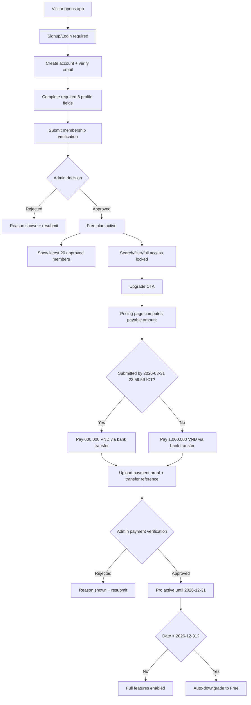

# Premium Conversion Plan for ABG Members Portal (with March 2026 Discount)

## Summary
Transform the app into a gated membership product with states: `Guest -> Pending Approval -> Free -> Pro`, and add a time-bound launch promotion.

Locked product decisions:
- Free plan sees only **20 members**
- Free plan has **no search/filter** and no access beyond free preview list
- Standard Pro price: **1,000,000 VND/member**
- Promo Pro price: **600,000 VND/member** (40% off)
- Promo window: **through March 31, 2026, 23:59:59 (Asia/Ho_Chi_Minh)**
- Pro entitlement expires on **December 31, 2026** (fixed date)
- Payment method for launch: **bank transfer only**
- Approval UX: **pending queue + email notification**
- Required onboarding profile fields: **8 core fields**
- Member data source of truth: **app database only**
- Free preview list: **latest 20 approved users**

---

## Pricing & Promo Rules (New/Updated)
1. Price determination is based on `payment_submitted_at` timestamp (server-side).
2. If `payment_submitted_at <= 2026-03-31 23:59:59 Asia/Ho_Chi_Minh`, required amount is `600000 VND`.
3. If after cutoff, required amount is `1000000 VND`.
4. Admin payment review must validate amount against computed required amount.
5. UI must always show both:
   - current payable amount
   - campaign end date/time in absolute format
6. No retroactive refund/adjustment logic in v1.

---

## User Flow (Updated)

---

## Public Interfaces / API Updates
1. `GET /billing/quote`  
   - Returns computed payable amount (`600000` or `1000000`) and promo metadata.
2. `POST /billing/proof`  
   - Persist submitted amount + timestamp + transfer reference + proof file.
3. `POST /admin/payment/<payment_id>/approve|reject`  
   - Approval validates expected amount by server promo rule.

Response additions:
- `expected_amount_vnd`
- `promo_applied` (boolean)
- `promo_cutoff_at` (`2026-03-31T23:59:59+07:00`)

---

## Data Model Updates
Add fields to `payment_submissions`:
- `submitted_amount_vnd` (int, required)
- `expected_amount_vnd` (int, computed server-side at submission)
- `promo_applied` (bool)
- `pricing_rule_version` (string, e.g. `launch-2026-march40`)

Optional settings table (if future flexibility needed):
- `pricing_campaigns(name, starts_at, ends_at, discount_percent, active)`

For v1, hardcoded campaign rule is acceptable if documented and tested.

---

## Validation Rules
1. Server is source of truth for time and expected amount.
2. Client-provided amount cannot override server-computed required amount.
3. Admin cannot approve payment when `submitted_amount_vnd < expected_amount_vnd` unless explicit override role exists (out of scope v1).

---

## Test Cases (Updated)

### Pricing Tests
1. Submission at `2026-03-31 23:59:59 +07:00` => expected `600000`.
2. Submission at `2026-04-01 00:00:00 +07:00` => expected `1000000`.
3. Timezone conversion tests ensure cutoff correctness.

### Payment Workflow
1. Discount-eligible user pays 600k, admin approves => Pro active.
2. Post-cutoff user pays 600k => admin blocked/reject with reason.
3. Post-cutoff user pays 1,000k => approvable.

### UI/Content
1. Upgrade page shows active price and explicit promo deadline.
2. After cutoff, promo banner disappears and standard price remains.

---

## Assumptions and Defaults
1. Promo cutoff is fixed to **March 31, 2026 23:59:59 Asia/Ho_Chi_Minh**.
2. Discount eligibility is based on payment submission timestamp, not signup date.
3. Pro expiry remains global fixed date **December 31, 2026**.
4. No prorating, no coupon stacking, no manual campaign editing in v1.

---

## Handover Output
Create/update handover doc at:
- `/Users/ducttv/Desktop/personal/abg/abg_membersportal/PREMIUM_PLAN.md`

Include this full specification as the implementation contract for the developer/agent.
