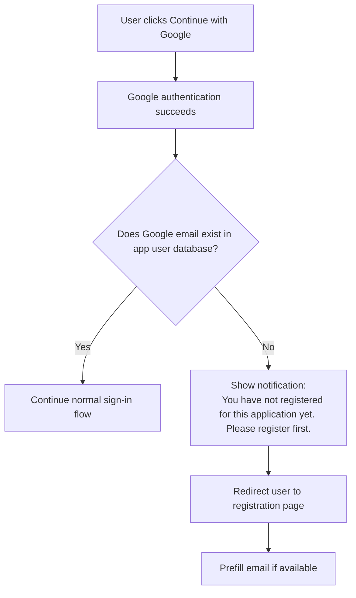

# Google Sign-In With Unregistered Email

## Purpose

Fix the current dead-end experience when a user signs in with Google using an email that does not exist in the application user database.

Right now, the user can complete Google sign-in but then cannot use app features and does not see clear guidance about what to do next. This creates confusion.

## Required Behavior

If a user signs in with Google and the Google email is not found in the application user database:

1. Do not let the user continue into the app in a silent blocked state.
2. Show a clear notification explaining that the email is not yet registered.
3. Redirect the user to the registration page.

## UX Requirement

### Trigger

- User clicks `Continue with Google`
- Google authentication succeeds
- Returned Google email is not found in the app user database

### Expected Result

Show a notification such as:

`You have not registered for this application yet. Please register first.`

Then redirect the user to the registration page.

## Recommended UX Copy

### Primary message

`You have not registered for this application yet. Please register first.`

### Optional friendlier version

`We could not find an account for this Google email. Please register first to access ABG Alumni Connect.`

### CTA on the registration page

`Create your account`

## Redirect Rule

After the notification appears, redirect the user to the registration page.

Recommended behavior:

- show notification first
- redirect immediately or after a very short delay
- preserve the Google email if possible so the registration form can be prefilled

## Suggested Flow

## Functional Requirements

1. System must check whether the authenticated Google email already exists in the application user database.
2. If the email does not exist, system must not leave the user signed in without direction.
3. System must show a notification before or during redirect.
4. System must redirect the user to the registration page.
5. Registration page should receive the Google email if technically available.

## Edge Cases

### Unregistered Google email

- Show notification
- Redirect to registration page

### Registered Google email

- Continue normal login flow

### Google returns an email but registration page already has data

- Prefer prefill without overwriting user-entered values unexpectedly

### Redirect loop prevention

- Do not keep sending the user back and forth between login and register

## Acceptance Criteria

1. A user who signs in with Google using an unregistered email sees a clear explanation of what happened.
2. That user is redirected to the registration page instead of being left in a blocked state.
3. A user with a registered Google email can continue normal sign-in.
4. The message clearly tells the user to register first.

## Implementation Notes

- This should be treated as a UX correction, not a silent auth failure.
- The app should avoid creating confusion by making the next action explicit.
- If possible, carry the Google email into the registration form to reduce friction.
